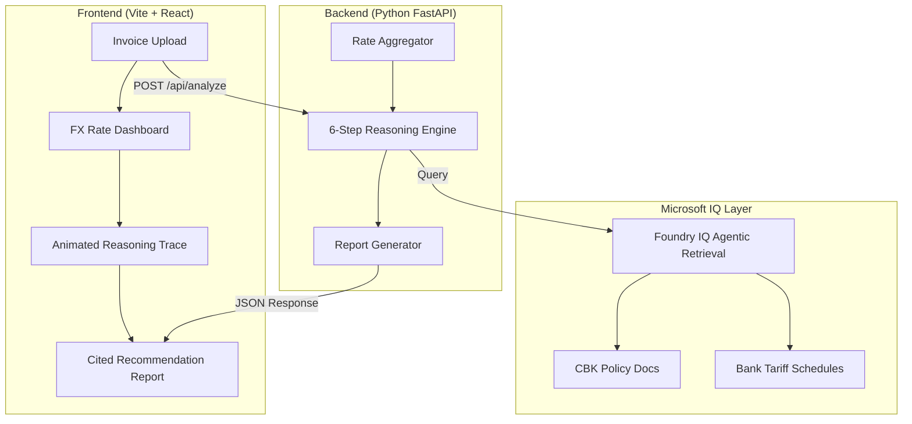

# SafariFX — AI Treasury Advisor

**Track**: 🧠 Reasoning Agents  
**IQ Layer**: Microsoft Foundry IQ  
**Event**: Agents League Hackathon (June 4 – 14, 2026)  

---

## 🌍 The Problem: Frontier Market FX Liquidity

Kenyan import-heavy businesses face extreme friction when purchasing USD. The KES/USD spread between commercial banks can vary by 2–4 KES on any given day. Finance managers currently rely on manual phone calls to 3–5 banks, negotiating rates without visibility into Central Bank of Kenya (CBK) auction schedules, interbank liquidity trends, or hidden bank-specific tariff structures (SWIFT fees, correspondent charges). 

This manual process leads to sub-optimal execution timing, massive spread losses, and zero compliance traceability.

**The Global Scale**: This is not just a Kenyan problem. This exact multi-bank FX optimization challenge destroys margins for businesses across **Nigeria, Egypt, Pakistan, Argentina, and Ghana** — representing over 2 billion people in currency-volatile economies.

---

## 🚀 The Solution: SafariFX

SafariFX is an **AI-powered interbank treasury advisor** that navigates multi-bank FX liquidity constraints so importers stop losing money on every dollar purchase. 

It uses a **6-step reasoning chain** powered by **Microsoft Foundry IQ** to analyze pending invoices against real-time market rates, score commercial banks based on total effective cost, and generate fully cited, timing-optimized FX purchase recommendations.

### The 6-Step Reasoning Engine
1. **Invoice Analysis**: Parses pending USD invoices, scoring urgency based on supplier deadlines.
2. **Market Intelligence**: Aggregates real-time indicative rates and liquidity profiles across 5 major commercial banks (Equity, KCB, Stanbic, NCBA, Co-op).
3. **Policy Grounding (Foundry IQ)**: Queries the Microsoft Foundry IQ knowledge base to ingest the latest CBK Monetary Policy Committee circulars and bank-specific FX tariff schedules.
4. **Bank Selection**: Runs a multi-criteria weighted scoring model (Spread + Liquidity + Fees) to identify the true lowest-cost execution path.
5. **Timing Optimization**: Analyzes 7-day trailing trends and upcoming CBK Treasury Bill auction dates to determine whether to execute *now* or *wait* for rate corrections.
6. **Recommendation Synthesis**: Outputs a comprehensive, cited advisory report calculating exact KES savings compared to the worst-case execution scenario.

---

## 🧠 Microsoft Foundry IQ Integration

SafariFX relies entirely on **Microsoft Foundry IQ** to ensure **zero-hallucination financial advice**. 

The reasoning engine queries the Foundry IQ knowledge base during **Step 3** to ground its recommendations in verified regulatory reality. 

**Grounding Sources Used:**
- `cbk_circulars.md`: Official Central Bank of Kenya monetary policy communiqués, USD liquidity directives, and T-bill auction results.
- `bank_tariffs.md`: Highly specific commercial bank tariff documents detailing SWIFT charges, minimum transaction thresholds, and correspondent bank routing fees.

Every recommendation generated by SafariFX includes a `📎 Grounding Source` citation tag linking directly to the specific policy or tariff that justified the decision.

---

## 🏗️ Architecture & Tech Stack



- **Frontend**: React (Vite) + Vanilla CSS. Features premium dark-mode aesthetics, glassmorphism, micro-animations, and an interactive reasoning-trace visualizer.
- **Backend**: Python 3.11 + FastAPI + Pydantic v2. Provides robust async endpoints and the core reasoning orchestration logic.
- **Intelligence**: Azure AI Projects SDK (`azure-ai-projects`) connecting to the Foundry IQ MCP Server.

---

## 💻 Local Setup & Execution

### Prerequisites
- Python 3.11+
- Node.js 18+
- An active Azure AI Foundry project with Foundry IQ enabled

### Backend Setup
```bash
cd backend
python -m venv .venv
source .venv/bin/activate  # On Windows: .venv\Scripts\activate
pip install -r requirements.txt

# Configure Azure Foundry IQ credentials (or omit to use Mock Mode)
cp ../.env.example .env
# Edit .env with your FOUNDRY_PROJECT_ENDPOINT

# Start the FastAPI server
uvicorn main:app --reload --port 8000
```
*Note: If Azure credentials are not provided, the backend automatically falls back to a highly realistic Mock Mode for hackathon evaluation purposes.*

### Frontend Setup
```bash
cd frontend
npm install
npm run dev
```
Navigate to `http://localhost:5173` to access the SafariFX dashboard.

---

## 🏆 Hackathon Rubric Alignment

- **Accuracy & Relevance (20%)**: Total reliance on Foundry IQ for grounding ensures decisions are based on real bank tariffs and CBK policy, not LLM hallucinations.
- **Reasoning & Multi-step (20%)**: The 6-step reasoning chain (Parse → Aggregate → Ground → Score → Optimize → Report) is visually traced in the UI and represents complex financial analysis.
- **Creativity & Originality (15%)**: Zero generic compliance tools here. SafariFX solves a highly specific, painfully real frontier-market liquidity problem that most global tech ignores.
- **User Experience (15%)**: Premium glassmorphic UI with animated reasoning traces that build trust by showing the AI's "thought process."
- **Reliability & Safety (20%)**: Mock-fallback mode ensures the demo never breaks during judging, while strict typing (Pydantic) prevents data corruption.

---
